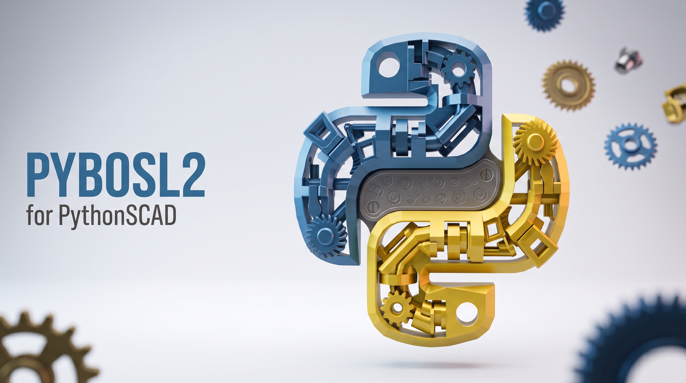

pybosl2 — a pure-Python PythonSCAD port of BOSL2
================================================

``pybosl2`` is a pure-Python / numpy port of the pieces of `BOSL2 <https://github.com/BelfrySCAD/BOSL2>`_
that this toolkit uses, with **no** ``osuse()``/BOSL2 runtime dependency. Every operation hangs off
an object — :class:`~pybosl2.path2d.Path2D` for 2-D outlines, :class:`~pybosl2.regions.Region` for
outlines-with-holes, :class:`~pybosl2.beziers.Bezier` / :class:`~pybosl2.beziers.BezierPatch` for bezier
curves and surfaces, :class:`~pybosl2.vnf.VNF` for vertex-face meshes, and the backend-neutral
:mod:`pybosl2.solid` / :mod:`pybosl2.flat` constructors — so new code reads as fluent chains::

    Path2D([[0, 0], [80, 0], [80, 60], [0, 60]]).offset(r=-2).round_corners(radius=1).polygon()

**New here?** :doc:`getting_started` builds one real part end to end — solid, roundover, bore,
boss, measurement, exported file — before any of the reference below.

.. raw:: html

   

     &#9881;&#65039; <b><a href="specs/index.html">Visual parts catalog &amp; spec sheets &rarr;</a></b>
     &nbsp;&mdash;&nbsp; the gears, hinges, joiners, cube-truss and ball-bearing modules with
      technical schematics and metrics measured from real rendered STL.
   

.. raw:: html

   

     <b>Released versions:</b> 
     &ensp;<b><a id="latest-link" href="">latest &rarr;</a></b>
   

   

     &#9888;&#65039; <b>This is the unreleased development version.</b>
     See the <a href="../index.html">latest stable release</a> for production use.
   

   <!-- version loader -->
   

Rendered examples
-----------------

Every documented function with a rendered example shows both the exact PythonSCAD code and what the
real PythonSCAD binary builds for it, via the ``pythonscad-example`` directive (in
``docs/_ext/pybosl2_example.py``): an **interactive 3-D viewer** for the exported STL mesh (rotate,
pan and zoom — served by the ``stl_viewer`` extension's three.js viewer, a working drop-in for the
``sphinxstl`` ``.. stl::`` directive), plus a **download link** to the mesh. Two-dimensional or
open-surface examples that have no solid mesh fall back to a static preview image.

.. note::

   The interactive viewers fetch each ``.stl`` over HTTP, so view the built docs through a web
   server (for example ``python3 -m http.server`` from ``pybosl2/wiki``) rather than opening the
   HTML files directly with a ``file://`` URL, where browsers block the local mesh fetch. You can
   also embed a viewer for any STL yourself with ``.. stl:: path/to/mesh.stl``.

A cuboid primitive:

.. pythonscad-example::

   from pybosl2.solid import cuboid

   cuboid([40, 30, 20], rounding=4).show()

A bezier surface patch, meshed to a VNF and rendered as a polyhedron:

.. pythonscad-example::

   from pybosl2 import BezierPatch

   patch = [
       [[-50, -50, 0], [-16, -50, 20], [16, -50, -20], [50, -50, 0]],
       [[-50, -16, 20], [-16, -16, 20], [16, -16, -20], [50, -16, 20]],
       [[-50, 16, 20], [-16, 16, -20], [16, 16, 20], [50, 16, 20]],
       [[-50, 50, 0], [-16, 50, -20], [16, 50, 20], [50, 50, 0]],
   ]
   BezierPatch(patch).sheet([0, -6], splinesteps=16).polyhedron().show()

Sweeping a profile along a bezier curve:

.. pythonscad-example::

   import math
   import numpy as np
   from pybosl2 import Bezier

   circle = [[2 * math.cos(t), 2 * math.sin(t)] for t in np.linspace(0, 2 * math.pi, 24, endpoint=False)]
   Bezier([[0, 0, 5], [0, 0, 20], [25, 12, 15], [30, 4, 6]]).sweep(circle, splinesteps=24).show()

API reference
-------------

The modules are grouped by role, mirroring BOSL2's own organisation. **Foundational** holds the
primitives and transforms most models start from; **Paths, regions & surfaces** the advanced
2-D/3-D modelling toolkit; **Math & geometry** the numeric helpers; and **Parts library** the
ready-made mechanical parts — each with a visual spec sheet in the catalog linked above.

For how far the port goes, see the :doc:`BOSL2 coverage table <bosl2_coverage>`: every upstream
``.scad`` file against the pybosl2 module that ports it (SPEC B2-1).

.. toctree::
   :maxdepth: 1
   :caption: Start here

   getting_started

.. toctree::
   :maxdepth: 1
   :caption: Solid backends
   :glob:

   backends/*

.. toctree::
   :maxdepth: 1
   :caption: Foundational
   :glob:

   foundational/*

.. toctree::
   :maxdepth: 1
   :caption: Paths, regions & surfaces
   :glob:

   paths/*

.. toctree::
   :maxdepth: 1
   :caption: Math & geometry
   :glob:

   math/*

.. toctree::
   :maxdepth: 1
   :caption: Parts library
   :glob:

   parts/*

.. toctree::
   :maxdepth: 1
   :caption: Extras
   :glob:

   extras/*

.. toctree::
   :maxdepth: 1
   :caption: Coverage

   bosl2_coverage

.. toctree::
   :maxdepth: 1
   :caption: Parts catalog

    Visual specs &rarr; <specs/index>
